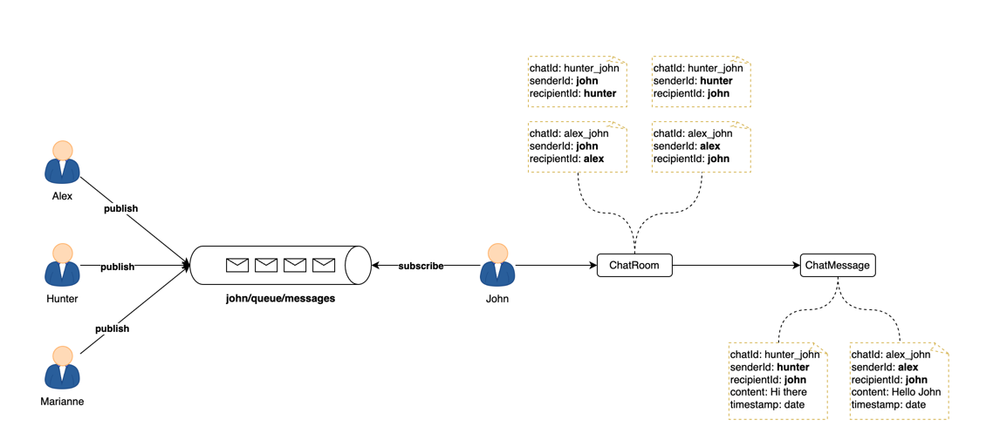

## Spring WebSocket Chat Application

**Overview**

Spring WebSocket Chat Application is a real-time, one-on-one chat application built using Spring Boot and WebSockets. It provides a secure and persistent platform for private communication.

**Features**

* **One-on-one chat:** Engage in private, real-time conversations with other users.
* **Secure communication:** Messages are transmitted securely using WebSockets.
* **Persistent chat:** Chat history is stored in a MongoDB database for future reference.


---



---

**Installation**

1. **Clone the repository:**

   ```bash
   git clone git@github.com:ria-19/Chat-application-.git
   ```

2. **Change directory:**

   ```bash
   cd Chat-application-
   ```

3. **Build the project:**

   ```bash
   ./mvnw clean install
   ```

4. **Configure MongoDB:**
    * Create a MongoDB database and collection for chat messages.
    * Update the MongoDB connection details in the `application.properties` file.

5. **Run the application:**

   ```bash
   ./mvnw spring-boot:run
   ```

**Technologies**

* Spring Boot
* WebSockets
* MongoDB
* JavaScript
* HTML
* CSS


**Usage**

* **Access the application:** Open your web browser and navigate to `http://localhost:8080`.
* **Create a new chat:** Enter your username and the username of the user you want to chat with.
* **Start chatting:** Send and receive messages in real time.

**Contributing**

Contributions to this project are welcome! Please feel free to submit pull requests or issues.

Acknowledgment: Thanks to Ali Bouali for their open-source project and amazing tutorial on 'One-to-One Chat with Spring Boot and WebSockets'
